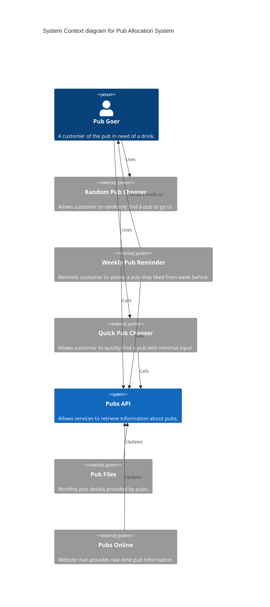
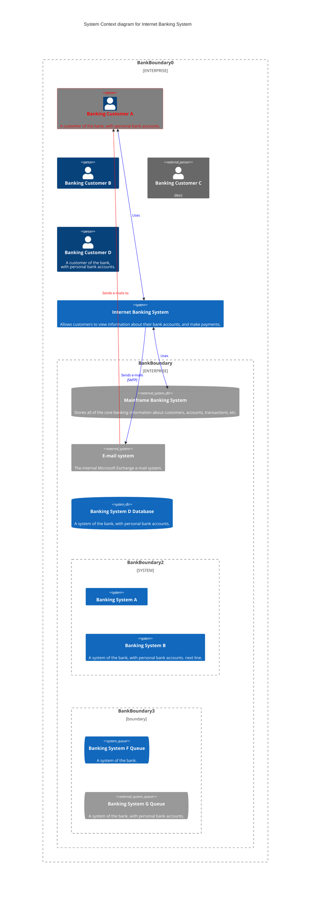

# sandbox

```mermaid
graph TB
    subgraph "Row 1: Person"
        customer[Pub Goer]
    end
    subgraph "Row 2: External Systems"
        pub_roulette[Random Pub Chooser]
        pub_fast_finder[Quick Pub Chooser]
        pub_reminder[Weekly Pub Reminder]
        pubs_online[Pubs Online]
        pub_files[Pub Files]
    end
    subgraph "Row 3: System"
        pubs[Pubs API]
    end

    customer -->|Uses| pub_roulette
    customer -->|Uses| pub_fast_finder
    pub_reminder -->|Sends e-mails to| customer
    pub_roulette -->|Calls| pubs
    pub_fast_finder -->|Calls| pubs
    pubs_online -->|Updates| pubs
    pub_files -->|Updates| pubs

    classDef system fill:#aaffaa;
    classDef person fill:#ffaaaa;
    classDef system_ext fill:#ffddaa;
    classDef relation fill:#ffffff,stroke:#333333,stroke-width:2px;
    classDef arrowHead fill:#333333;

    class customer person;
    class pub_roulette,pub_fast_finder,pubs_online system_ext;
    class pubs system;

```





```
 <!-- System_Ext(mail_system, "E-mail system", "The internal Microsoft Exchange e-mail system.")
    System_Ext(mainframe, "Mainframe Banking System", "Stores all of the core banking information about customers, accounts, transactions, etc.")

    Rel(customer, pub_roulette, "Uses")
    Rel_Back(customer, mail_system, "Sends e-mails to")
    Rel_Back(pub_roulette, mail_system, "Sends e-mails", "SMTP")
    Rel(banking_system, mainframe, "Uses")

    UpdateElementStyle(customerA, $fontColor="red", $bgColor="grey", $borderColor="red")
    UpdateRelStyle(Person, SystemAA, $textColor="blue", $lineColor="blue", $offsetX="5")
    UpdateRelStyle(SystemAA, SystemE, $textColor="blue", $lineColor="blue", $offsetY="-10")
    UpdateRelStyle(SystemAA, SystemC, $textColor="blue", $lineColor="blue", $offsetY="-40", $offsetX="-50")
    UpdateRelStyle(SystemC, customerA, $textColor="red", $lineColor="red", $offsetX="-50", $offsetY="20")

    UpdateLayoutConfig($c4ShapeInRow="3", $c4BoundaryInRow="1") -->
```

